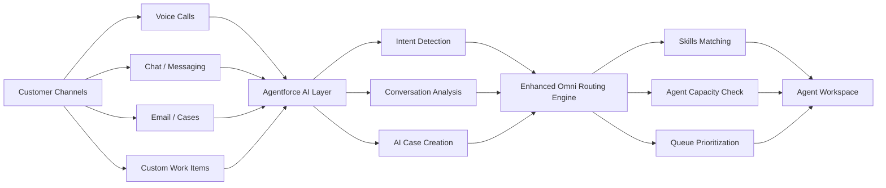
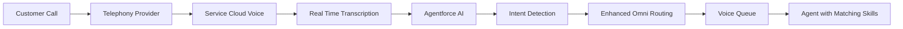
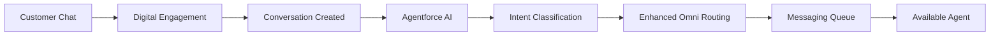
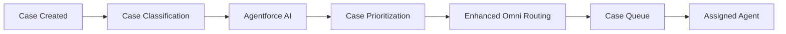
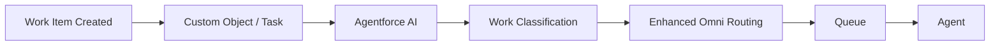
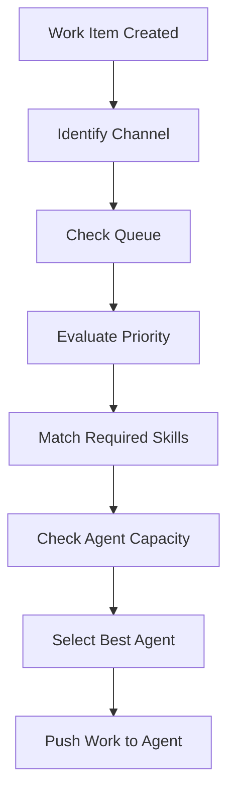
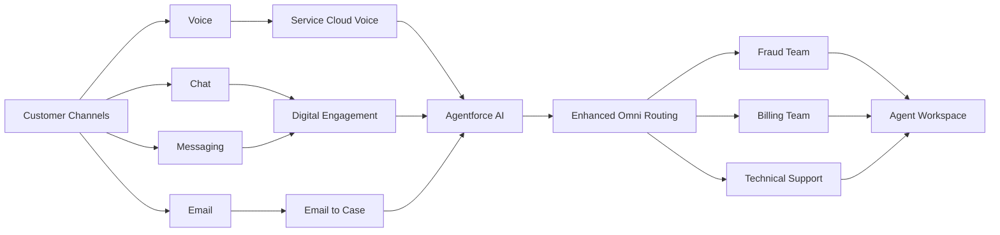

# Enhanced-Omni-Channel-Routing-for-Agentforce
Below is a **more advanced GitHub README** with **clear architecture diagrams, routing flows, and detailed explanations** for **voice, chat, case, and generic work item routing**.
You can **copy–paste directly into `README.md` in GitHub**.

---

# Enhanced Omni-Channel Routing for Agentforce

## Overview

**Enhanced Omni-Channel** is Salesforce’s modern routing engine used to intelligently distribute work items such as:

* Voice calls
* Chats
* Messaging conversations
* Cases
* Tasks
* Custom work items

It is a key component of AI-powered service architectures built using:

* Agentforce
* Salesforce Service Cloud
* Service Cloud Voice
* Salesforce Einstein

Enhanced Omni-Channel enables **real-time intelligent routing**, ensuring that work is delivered to the **most appropriate and available agent**.

---

# Table of Contents

* Overview
* Enhanced Omni-Channel Architecture
* Routing Models
* Routing for Different Channels

  * Voice Routing
  * Chat Routing
  * Case Routing
  * Generic Work Item Routing
* Agentforce Integration
* Routing Decision Flow
* Implementation Steps
* Best Practices
* Real Enterprise Architecture

---

# Enhanced Omni-Channel Architecture



The routing engine evaluates:

* Agent skills
* Agent availability
* Work item priority
* Queue configuration
* Agent capacity

---

# Routing Models

Enhanced Omni supports multiple routing strategies.

| Routing Model    | Description                                |
| ---------------- | ------------------------------------------ |
| Most Available   | Routes work to agent with highest capacity |
| Least Active     | Routes to agent with least active work     |
| Skills-Based     | Routes based on required skills            |
| External Routing | Routing handled outside Salesforce         |

---

# Voice Routing

Voice routing typically occurs through **Service Cloud Voice**.

## Voice Routing Flow



## Voice Routing Example

Customer calls support.

AI detects:

```
Intent: Credit Card Issue
Language: Hindi
Priority: High
```

Routing engine evaluates:

* Fraud support skill
* Hindi language skill
* Agent capacity

The call is routed to the **most suitable available agent**.

---

# Chat Routing

Chat channels include:

* Web chat
* WhatsApp
* SMS
* Apple Messages
* Facebook Messenger

## Chat Routing Flow



Example:

```
Customer message: "I want to change my billing plan"
```

AI detects:

```
Intent: Billing Support
```

Routing decision:

```
Billing Support Queue → Billing Specialist Agent
```

---

# Case Routing

Cases can be generated from:

* Email
* Web forms
* AI automation
* Chat or voice escalation

## Case Routing Flow



Example:

```
Case Type: Technical Issue
Priority: High
Product: Payments
```

Routing result:

```
Payments Technical Support Queue
```

---

# Generic Work Item Routing

Enhanced Omni can also route:

* Tasks
* Follow-ups
* Approvals
* AI generated work
* Custom objects

## Work Item Flow



Example:

```
AI generates follow-up task after customer call
```

Routing logic:

```
Account Owner → Sales Support Agent
```

---

# Agentforce Integration

Agentforce adds an **AI intelligence layer** on top of routing.

## Agentforce Responsibilities

AI performs:

* Intent detection
* Conversation summarization
* Auto case creation
* Suggested replies
* Escalation detection

Enhanced Omni then routes the work.

### Responsibility Split

```
Agentforce → Determines WHAT work should be created
Enhanced Omni → Determines WHO should receive the work
```

---

# Routing Decision Flow

Routing decisions occur in multiple stages.



Routing criteria include:

* Queue membership
* Skills match
* Agent availability
* Capacity limits
* Work priority

---

# Implementation Steps

## 1 Enable Omni-Channel

```
Setup → Omni-Channel → Enable
```

---

## 2 Enable Enhanced Omni Routing

```
Setup → Omni-Channel Settings
Enable Enhanced Routing
```

---

## 3 Create Skills

Example skills:

```
Banking Support
Technical Support
Hindi Language
Fraud Investigation
```

---

## 4 Assign Skills to Agents

```
Setup → Users → Skills
```

---

## 5 Configure Queues

Example queues:

```
Voice Support
Billing Support
Fraud Team
Technical Escalations
```

---

## 6 Configure Routing Configuration

Example routing configuration:

```
Routing Model: Most Available
Priority: 10
Capacity Weight: 1
```

---

## 7 Configure Presence Status

Agents must be available in Omni.

Examples:

```
Available for Voice
Available for Chat
Available for Messaging
Offline
```

---

# Best Practices

### Use Skills-Based Routing

Improves accuracy of routing for complex organizations.

---

### Configure Channel Capacity

Example:

| Channel   | Capacity |
| --------- | -------- |
| Voice     | 1        |
| Chat      | 3        |
| Messaging | 5        |

---

### Prioritize Critical Work

Use priority values for:

* VIP customers
* Escalations
* SLA breaches

---

### Combine AI with Routing

Use Agentforce to:

* Detect intent
* Create cases automatically
* Suggest agent responses

---

# Real Enterprise Architecture

Example **Banking Contact Center Architecture**



---

# Benefits

| Capability          | Benefit                           |
| ------------------- | --------------------------------- |
| AI driven routing   | Faster service                    |
| Skill matching      | Better expertise alignment        |
| Capacity balancing  | Prevent agent overload            |
| Real time routing   | Reduced wait times                |
| Channel unification | One platform for all interactions |

---

# Conclusion

Enhanced Omni-Channel is the **routing backbone** for AI-powered customer service.

When combined with **Agentforce**, organizations can build **scalable intelligent service operations** capable of handling large volumes of:

* Voice interactions
* Messaging conversations
* Cases
* AI-generated work

This architecture enables:

* Faster resolutions
* Intelligent automation
* Improved agent productivity
* Better customer experience


---

✅ If you want, I can also create an **even more advanced version including**:

* **Deep dive on Salesforce routing objects (Routing Config, Pending Service Routing, AgentWork)**
* **Service Cloud Voice call lifecycle diagram**
* **Omni Supervisor monitoring architecture**
* **Agentforce + RAG + Knowledge architecture**

These are extremely useful for **Salesforce architects and Agentforce implementations**.
